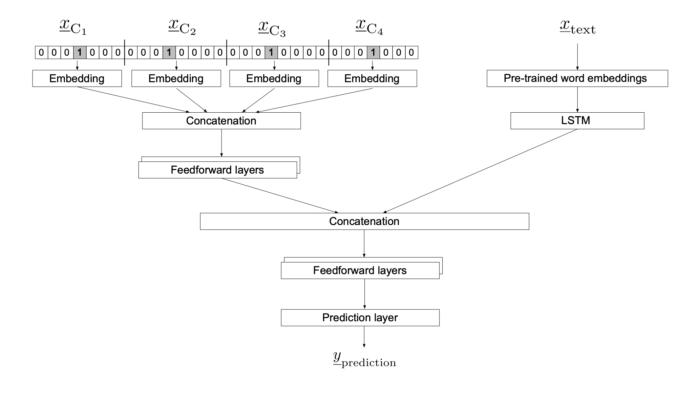

# DeepMM

## What is DeepMM?
*DeepMM* is a multimodal deep learning package based on [keras](https://github.com/keras-team/keras) and [tensorflow](https://github.com/tensorflow/tensorflow) that combines representations of high-cardinality categorical features together with text-based features in a single deep learning architecture for regression and binary classification use cases.

This model employs the idea of categorical entitiy embeddings (see [https://arxiv.org/abs/1604.06737]) for mapping highly sparse one-hot encoded categorical features into a latent lower-dimensional feature space. A *bi-interaction pooling* layer  (as proposed by He et al. 2017 [https://arxiv.org/abs/1708.05027]) is incorporated to account for second-order feature interactions. An LSTM-based sub-network is used to process the sequential text features.

The architecture is oriented on other deep learning approaches for processing sparse features, such as:
* He et al. (2017) *Neural factorization machines for sparse predictive Analysis* [https://arxiv.org/abs/1708.05027]
* Cheng et al. (2016) *Wide and deep learning for recommender systems* [https://arxiv.org/abs/1606.07792]
* Guo et al. (2017) *DeepFM: A Factorization Machine-based neural network for CTR prediction* [https://arxiv.org/abs/1703.04247]
* Wang et al. (2017) *Deep & Cross Network for ad click predictions* [https://arxiv.org/abs/1708.05123]

## Deep Learning Architecture
General outline of the multimodal model architecture (with concatenation of categorical embedding vectors) with four generic categorical features (C1-C4):



## Usage
The package exposes the architecture as a `keras.models.Model` object based on Keras' functional API. It supports the integration of pre-trained word embedding vectors.

```
from deepmm.models import DeepMultimodalModel

# Preprocess data and combine modalities into a single matrix
# ...

model = DeepMultimodalModel(task='regression', num_unique_categories=num_unique_categories, cat_embedding_dim=16,
                            txt_vocab_size=vocabulary_size, txt_embedding_dim=EMBEDDING_DIM, txt_max_len=MAX_LEN,
                           txt_weights=embedding_matrix,
                           cat_hidden_neurons=[100,50,10], cat_dropout=[0.1, 0.2, 0.2], cat_bi_interaction=True,
                           txt_lstm_neurons=32, txt_dropout=0.2, final_hidden_neurons=[64, 32], final_dropout=[0.3, 0.3])

```


